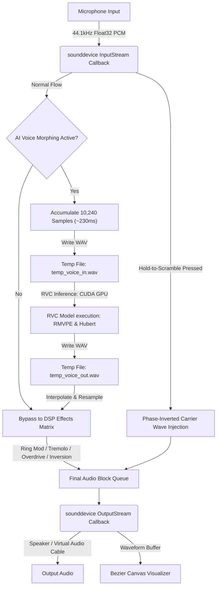

# 🎙️ AnonyVox — AI Voice Morphing & Cryptographic Redaction Engine

<p align="center">
  
  
  
  
</p>

AnonyVox is a real-time, desktop audio application built in Python that wraps Retrieval-based Voice Conversion (RVC), a spectral inversion (frequency mirroring) DSP engine, and a zero-latency semantic redaction scrambler into a single, cohesive, premium dark-theme utility.

---

## ⚡ Key Features

1. **Low-Latency Duplex Audio Pipeline**
   * Multi-threaded audio stream mapping using `sounddevice` running at `44100Hz` mono.
   * Lock-free thread queues separating real-time audio callback contexts from the GUI thread to ensure zero UI stutter.
2. **RVC AI Voice Conversion (GPU Accelerated)**
   * Real-time neural network voice cloning using `rvc-python`.
   * Automatically pairs `.pth` model weights and `.index` files from the `models/` directory using token-based fuzzy matching.
3. **Spectral Inversion Engine (Frequency Mirroring)**
   * Parallel DSP matrix loop computing the Real Fast Fourier Transform (`rfft`) of incoming audio.
   * Flips AC frequency coefficients upside down, then reconstructs the signal with inverse `rfft` (`irfft`) to create an alien-sounding privacy scrambled voice.
4. **Vocal Effects Matrix**
   * Real-time vocal DSP processing including **Ring Modulation** (carrier-mixed wave), **Tremolo** (LFO-driven amplitude modulation), and **Vocal Overdrive Distortion**.
5. **AI Semantic Redaction ("Hold to Scramble")**
   * Click-and-hold vocal scramble button. Bypasses the inference pipeline instantly to inject a phase-inverted carrier-mixed wave, creating a heavy sci-fi privacy blur.
6. **Premium Cyberpunk Dashboard**
   * Neon-cyan (`#06b6d4`) and dark-slate (`#0f172a`) UI aesthetic.
   * Live reactive Canvas-based waveform visualizer running at 33 FPS with bezier curve interpolation.

---

## 📐 Architecture & Audio Flow



---

## 📂 Project Structure

```text
AnonyVox/
├── assets/                  # UI graphical assets and icons
├── models/                  # Put your RVC weights (.pth) and indices (.index) here
├── app.py                   # Main GUI Application logic and thread managers
├── install_dependencies.py  # Automation script installing conflicting wheels (fairseq, faiss)
└── requirements.txt         # Consolidated python dependency list
```

---

## 🛠️ Setup & Installation

### Prerequisite Checklist
* **Python**: `3.11`, `3.12`, or `3.13` (64-bit) installed.
* **FFmpeg**: Must be installed and added to your system's PATH.
* **CUDA Support**: Ensure you have an NVIDIA GPU and that CUDA Toolkit matches your PyTorch installation.

### 1. Set Up a Virtual Environment (Recommended)
```bash
python -m venv venv
venv\Scripts\activate
```

### 2. Install Dependencies
Run the automated installation script. This script handles the complex installation of Windows-specific precompiled wheels (like `fairseq` and `faiss-cpu`) to avoid compiler errors:
```bash
python install_dependencies.py
```

*Note: For GPU acceleration, the application utilizes CUDA-enabled PyTorch. If you need to manually install/reinstall PyTorch with GPU hooks:*
```bash
pip install torch torchaudio --index-url https://download.pytorch.org/whl/cu118
```

### 3. Load RVC Models
Place your RVC voice models (`.pth`) and their corresponding index mapping files (`.index`) directly into the `models/` folder. The app uses fuzzy token string search to automatically match model weights to their corresponding index files.

### 4. Start AnonyVox
```bash
python app.py
```

---

## 🎮 How to Use & Route Audio
To morph your voice live in communication apps (Discord, Zoom, Teams, etc.):
1. Install a virtual audio device such as **VB-Audio Virtual Cable**.
2. Run **AnonyVox**.
3. Set **Input Microphone** in AnonyVox to your physical microphone.
4. Set **Output Speaker/VAC** to **CABLE Input (VB-Audio Virtual Cable)**.
5. Enable **Activate AI Voice Morphing Pipeline** and select your model.
6. Open your communication app (e.g., Discord) and set the **Input Device** to **CABLE Output (VB-Audio Virtual Cable)**.

---

## 🔧 Troubleshooting

#### 1. Voice Changer is Laggy / CPU usage is 100%
* Make sure PyTorch detects your NVIDIA GPU. You can check this by verifying that the status label displays `GPU: CUDA:0` instead of `CPU`.
* Ensure your GPU drivers are up-to-date and the CUDA Toolkit is installed.

#### 2. Sound Output is Choppy or Crackling
* Check if your microphone and speaker share the same sample rate in Windows sound settings (e.g., both set to `16-bit 44100Hz` or `24-bit 48000Hz`).
* If using Virtual Audio Cable, verify that the VAC sample rate matches the application sample rate (`44100Hz`).

#### 3. fairseq Installation Fails
* Standard `pip install fairseq` fails on Windows. Ensure you run `python install_dependencies.py`, which downloads and installs the official precompiled wheel built for Windows and Python versions `3.11`–`3.13`.
